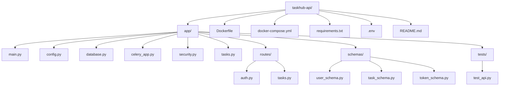

🚀 TaskHub API — FastAPI + MongoDB + Celery
A modern, containerized backend for task management with user authentication,
async background jobs, and MongoDB persistence — built using FastAPI, Motor, Celery, and Redis.

🧱 Tech Stack
Layer	Technology
Backend Framework	FastAPI (Python 3.12)
Database	MongoDB (Async via Motor)
Background Tasks	Celery + Redis
Containerization	Docker + Docker Compose
Authentication	JWT (OAuth2PasswordBearer)
Data Validation	Pydantic v2
Testing	Pytest + HTTPX

⚙ Project Structure

🚀 Quick Start
1. Clone & Build
git clone https://github.com/sulimankh87/taskhub-api.git
cd taskhub-api
docker compose up -d --build

✅ This launches:
FastAPI → http://localhost:8000
MongoDB → mongodb://localhost:27017
Redis (Celery broker)
Celery worker

2. Run Tests
docker compose exec api pytest -v
Expected:
app/tests/test_api.py::test_health_check PASSED

3. API Documentation
Open your browser:
👉 http://localhost:8000/docs

Interactive Swagger UI for all endpoints.

4. Example Workflow
Register → /auth/register
Login → /auth/login (returns JWT)
Use Token → /tasks/ endpoints
Background Task → Created via Celery in Redis

🧠 Testing Notes
Includes test_health_check for CI
Use pytest --disable-warnings -v for cleaner output
Add new tests under app/tests/

🛡️ Security
JWT authentication with bcrypt password hashing
TrustedHostMiddleware to block Host header attacks
.env secrets never committed

👷‍ Deployment
docker compose -f docker-compose.yml up -d --build

Or on Kubernetes (future step):
kubectl apply -f k8s/

📄 License
MIT License © 2025 Suleiman Khasheboun suli.tempmail2022@gmail.com